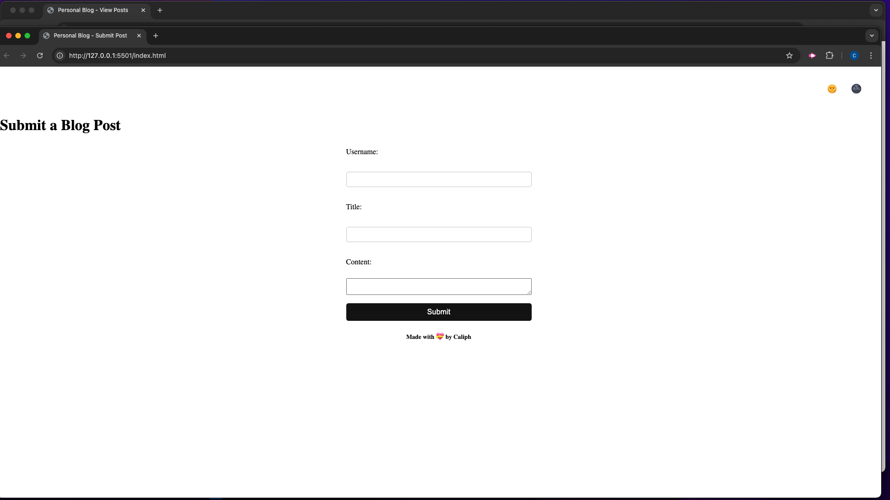
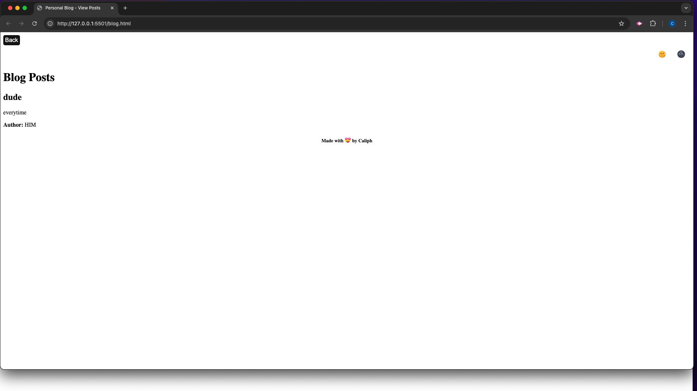

# Blog Forum

## Table of Contents
* Description
* Usage
* Mock-up
* License

## Description

Blog Forum website where users can input and view blog posts. The website features a form for users to submit new posts, and dynamically displays the posts on a separate page. It also includes a light/dark mode toggle for user preference and saves the blog posts to localStorage.

## Usage/Examples

    1. Navigate to the landing page.
    2. Fill in the form with your username, blog title, and content.
    3. Click the "Submit" button to add the blog post.
    4. After submission, you'll be redirected to the posts page, where all blog posts are displayed.
    5. Use the light/dark mode toggle to switch between themes.
    6. Click the "Back" button to return to the form and submit more posts.

## Mock-Up

The following animation demonstrates the application functionality:

## License

This project is licensed under the MIT License.